# **1. List Data Structure**


# **Objectives**

- Describe List structures
- Describe self-referential structures
- Explain types of linked lists
- Singly Linked Lists
- Circular Lists
- Doubly Linked Lists
- Lists in java.util


# **List Data Structures**

- A list is a sequential data structure, i.e. it is a sequence of items of a given base type, where items can be added, deleted, and retrieved from any position in the list.
- A list can be implemented as an array, or as a dynamic array to avoid imposing a maximum size.
- An alternative implementation is a linked list, where the items are stored in nodes that are linked together with pointers. These two implementations have very different characteristics.
- The possible values of this type are sequences of items of type BaseType (including the sequence of length zero). The operations of the ADT are:

```
getFirst(), getLast(), getNext(p), getPrev(p), get(p),
set(p,x), insert(p,x), remove(p),removeFirst(),
removeLast(), removeNext(p), removePrev(p),
find(x),size()
```


# **Drawbacks of Arrays**

- Array is a very useful data structure in many situations. However, it has some important limitations:
  - They require size information for creation
  - Inserting an element in the middle of an array leads to moving other elements around
  - Deleting an element from the middle of an array leads to moving other elements around
- Other data structures are more efficient in such situations.


# **Self-Referential Structures**

Many dynamic data structures are implemented through the use of a **selfreferential structure**.

A self-referential structure is an object, one of whose elements is a reference to **another object of its own type**.

With this arrangement, it is possible to create 'chains' of data of varying forms:

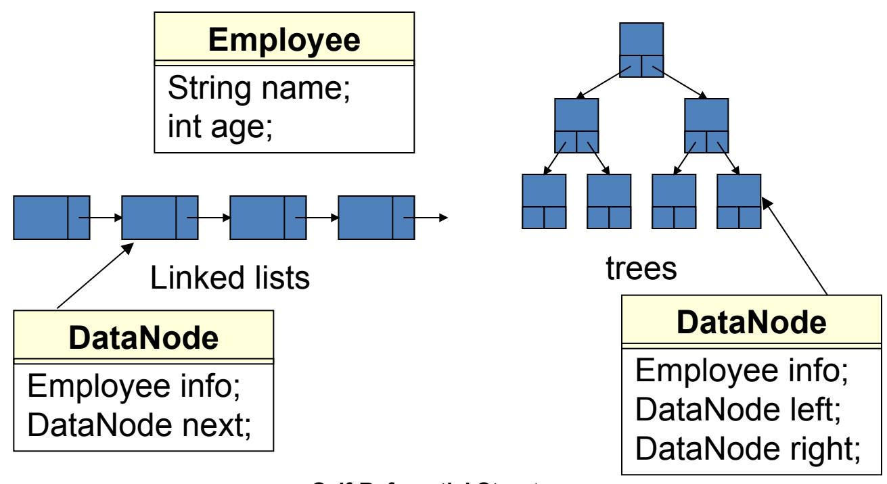

**Self-Referential Structures**


# **Linked Lists**

- A **linked structure** is a collection of nodes storing data and links to other nodes
- A **linked list** is a linear data structure composed of nodes, each node holding some information and a reference to another node in the list
- Types of linked lists:
  - Singly-Linked List
  - Doubly-Linked List

In programming, linear means that they are described by one (single) series of data … ie. Each data item has at most one predecessor and at most one successor.

And, Non-linear means anything else.

Linear are – Array, Linked List, Stack, Queue. Non Linear are – Tree, Graph


# **Singly Linked Lists**

A **singly linked list** is a list whose node includes two datafields: info and next. The info field is used to store information, and this is important to the user. The next field is used to link to its successor in this sequence The following image depicts a simple integer linked list.

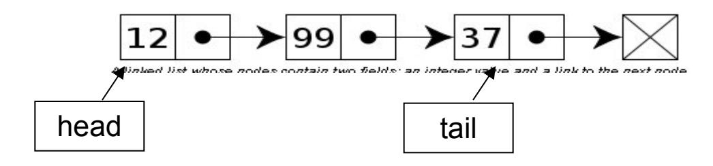

**Singly Linked List**


# **Singly Linked List Implementation**

```
8
class Node
{int info;
 Node next;
 Node() {}
 Node(int x, Node p)
  {info=x;next=p;
  }
}
```

```
class MyList
{Node head,tail;
 MyList()
{head=tail=null;}
 boolean isEmpty()
  {return(head==null);
  }
 void clear()
  {head=tail=null;
  }
```

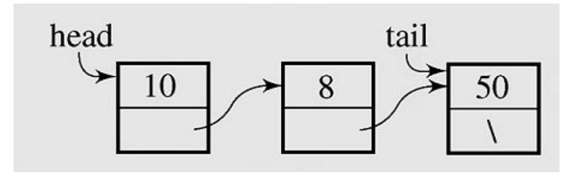

```
void add(int x)
  { if(isEmpty())
   head=tail=new Node(x,null);
   else
    {Node q =new Node(x,null);
    tail.next=q; tail=q;
    }
  }
 void traverse()
  {Node p=head;
  while(p!=null)
   {System.out.print(" " + p.info);
    p=p.next;
   }
  System.out.println();
  }
 Node search(int x) {...}
  void dele(int x) {...}
}
```


# **Singly Linked Lists - 1**

### *Inserting a new node at the beginning of a list*

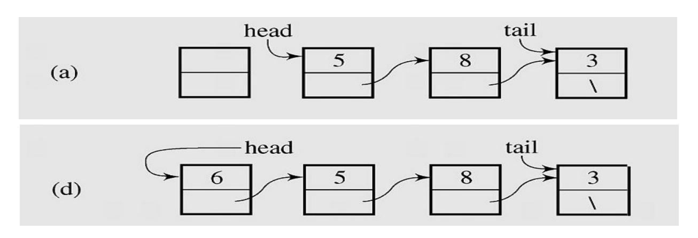

**Inserting a new node at the beginning of a Singly Linked List**


# **Singly Linked Lists - 2**

### *Inserting a new node at the end of a list*

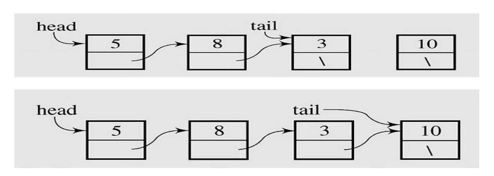

**Inserting a new node at the end of a Singly Linked List**


### **Singly Linked Lists - 3**

### *Deleting a node from the beginning of a list*

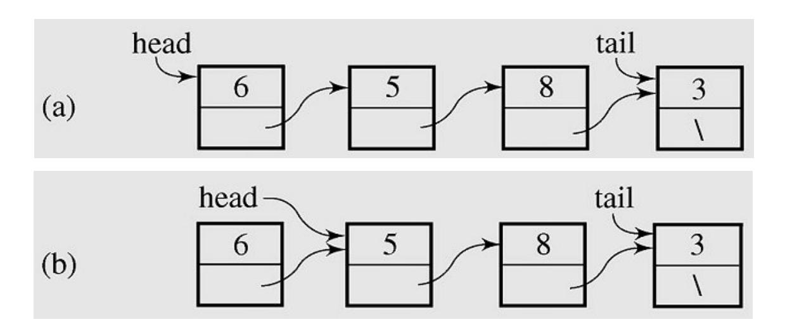

**Deleting a node from the beginning of a Singly Linked List**


### **Singly Linked List - 4**

### *Deleting element from the end of a list*

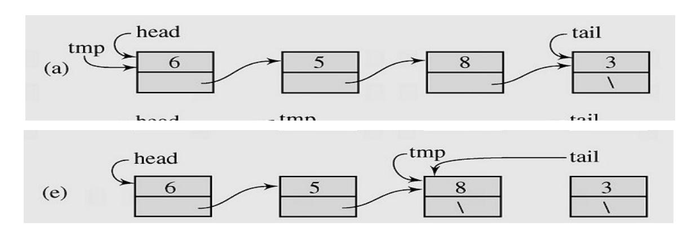

**Deleting a node from the end of a Singly Linked List**


# **Circular Lists - 1**

• A **circular list** is when nodes form a ring: The list is finite and each node has a successor

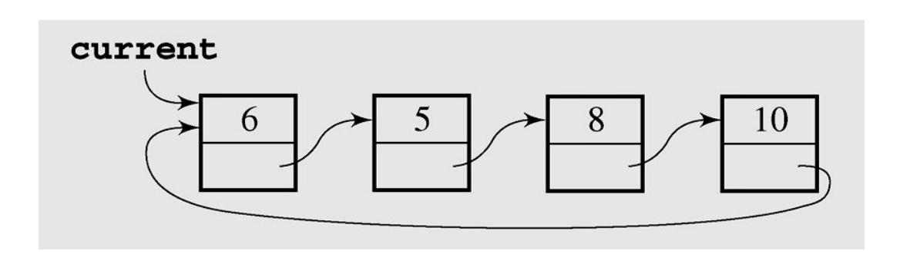

**Circular SIngly Linked List**


### **Circular Lists - 2**

### *Inserting nodes*

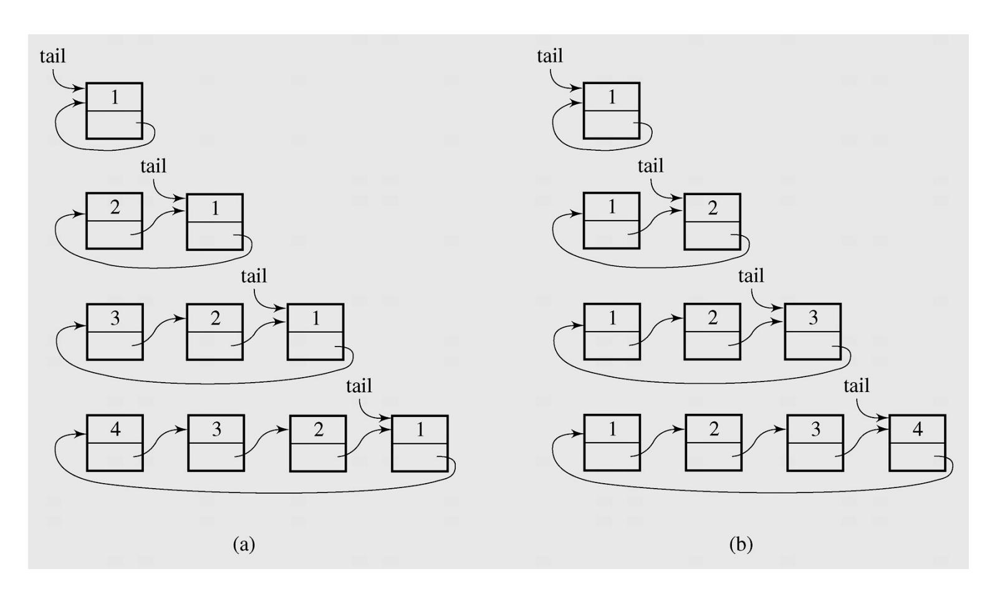

**Inserting nodes at the front of a circular singly linked list (a) and at its end (b)**


### **Circular List application**

#### <sup>15</sup>**1. Round-Robin Scheduling**

One of the most important roles of an operating system is in managing the many processes that are currently active on a computer, including the scheduling of those processes on one or more central processing units (CPUs). In order to support the responsiveness of an arbitrary number of concurrent processes, most operating systems allow processes to effectively share use of the CPUs, using some form of an algorithm known as *round-robin scheduling*. A process is given a short turn to execute, known as a *time slice*, but it is interrupted when the slice ends, even if its job is not yet complete. Each active process is given its own time slice, taking turns in a cyclic order.

#### **2. Using circular linked list to implement Round-Robin Scheduling**

We can use circular linked list to implement Round-Robin Scheduling by the following method: rotate( ): Moves the first element to the end of the list. With this new operation, round-robin scheduling can be efficiently implemented by repeatedly performing the following steps on a circularly linked list *C*:

- 1. Give a time slice to process *C*.first( )
- 2. *C*.rotate( )


# **Doubly Linked Lists - 1**

<sup>16</sup>• In a **doubly linked list,** each node has two reference fields, one to the successor and one to the predecessor

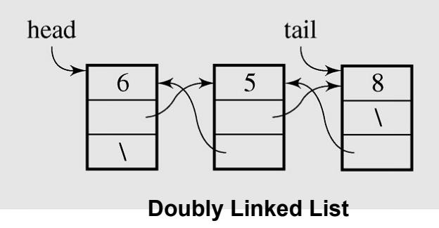

```
class Node
{int info;
 Node prev,next;
 Node() {}
 Node(int x, Node p, Node q)
 {info=x;prev=p; next=q;
 }
}
```

```
class MyList
{Node head,tail;
 MyList() {head=tail=null;}
 boolean isEmpty()
  {return(head==null); }
 void clear() {head=tail=null;}
 void add(int x)
  {if(isEmpty())
   head=tail=new Node(x,null,null);
   else
   {Node q =new Node(x,tail,null);
    tail.next=q;
    tail=q;
   }
  }
...
}
```


### **Doubly Linked Lists - 2**

### *Adding a new node at the end*

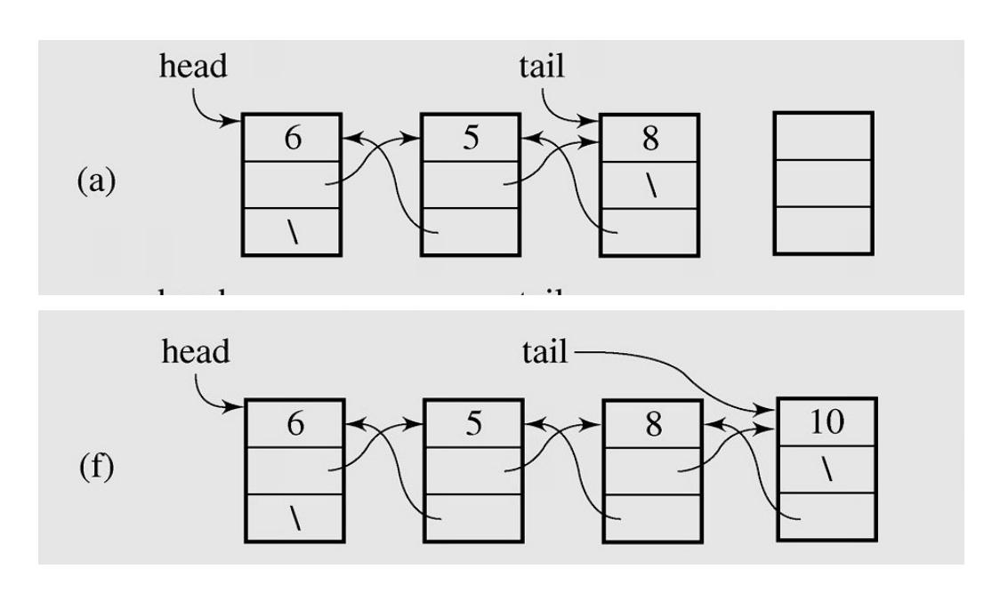

**Adding new node at the end of Doubly Linked List**


### **Doubly Linked Lists -3**

### *Deleting a node from the end*

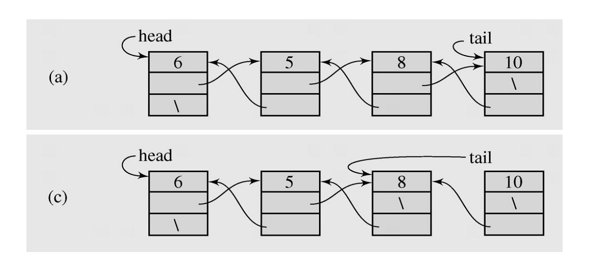

**Deleting a node from the end of Doubly Linked List**


# **Lists in java.util - LinkedList class**

| boolean  | add(E<br>o)<br>Appends the specified element to the end of this list.            |
|----------|----------------------------------------------------------------------------------|
| void     | addFirst(E<br>o)<br>Inserts the given element at the beginning of this list.     |
| void     | addLast(E<br>o)<br>Appends the given element to the end of this list.            |
| void     | Removes all of the elements from this list.<br>clear()                           |
| E        | get(int index)<br>Returns the element at the specified position in this list.    |
| E        | getFirst()<br>Returns the first element in this list.                            |
| E        | getLast()<br>Returns the last element in this list.                              |
| E        | remove(int index)<br>Removes the element at the specified position in            |
|          | this list.                                                                       |
| E        | removeFirst()Removes and returns the first element from this list.               |
| E        | Removes and returns the last element from this list.<br>removeLast()             |
| int      | Returns the number of elements in this list.<br>size()                           |
| Object[] | toArray()<br>Returns an array containing all of the elements in this list in the |
|          | correct order.                                                                   |


# **Lists in java.util LinkedList class example**

```
import java.util.*;
class Node
 { String name;
   int age;
   Node() {}
   Node(String name1, int age1)
     { name=name1; age=age1;
     }
   void set(String name1, int age1)
     { name=name1; age=age1;
     }
   public String toString()
     { String s = name+" "+age;
       return(s);
     }
 }
```

```
class Main
  {
   public static void main(String [] args)
     {
      LinkedList t = new LinkedList();
       Node x; int n,i;
       x = new Node("A01",25); t.add(x);
       x = new Node("A02",23); t.add(x);
       x = new Node("A03",21); t.add(x);
       for(i=0;i<t.size();i++)
      System.out.println(t.get(i));
     }
  }
```


# **Lists in java.util - ArrayList class**

| boolean      | add(E<br>o)<br>Appends the specified element to the end of this list.                                                                                                                                               |
|--------------|---------------------------------------------------------------------------------------------------------------------------------------------------------------------------------------------------------------------|
| void         | add(int<br>index,<br>E<br>o)<br>Inserts the given element at the specified pos.                                                                                                                                     |
| void         | clear()<br>Removes all of the elements from this list.                                                                                                                                                              |
| E            | Returns the element at the specified position in this list.<br>get(int index)                                                                                                                                       |
| E            | Removes the element at the specified position in this<br>remove(int index)<br>list.                                                                                                                                 |
| int          | size()<br>Returns the number of elements in this list.                                                                                                                                                              |
| void         | ensureCapacity(int minCapacity)<br>Increases the capacity of this<br>ArrayList<br>instance, if necessary, to ensure that it can hold at least the number of elements<br>specified by the minimum capacity argument. |
| void         | trimToSize()<br>Trims the capacity of this<br>ArrayList<br>instance to be the list's<br>current size.                                                                                                               |
| Object[<br>] | Returns an array containing all of the elements in this list in the<br>toArray()<br>correct order.                                                                                                                  |


# **Summary**

- A list is a sequential data structure, i.e. it is a sequence of items of a given base type.
- A list can be implemented as an array, or as a dynamic array to avoid imposing a maximum size.
- An alternative implementation is a linked list , where the items are stored in nodes that are linked together with pointers.
- A singly linked list is when a node has a link to its successor (next node) only.
- A circular list is when nodes form a ring: The list is finite and each node has a successor.
- A doubly linked list is when a node has links to its previous and to the next nodes.


# **Reading at home**

#### **Text book: Data Structures and Algorithms in Java**

- 3 Fundamental Data Structures 103
- 3.1 Using Arrays . 104
- 3.2 Singly Linked Lists 122
- 3.3 Circularly Linked Lists 128
- 3.4 Doubly Linked Lists 132