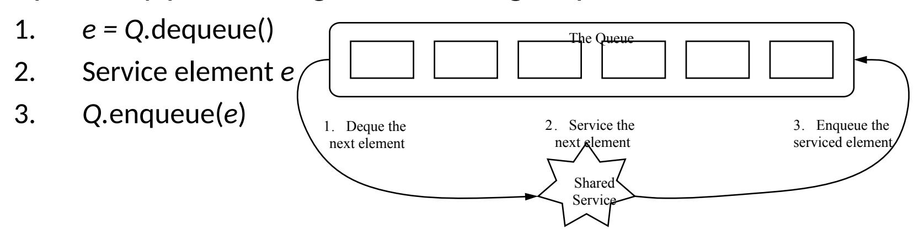
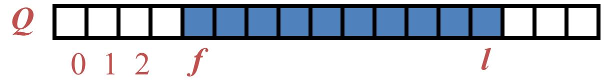
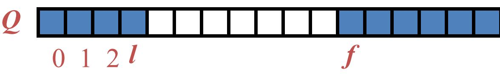
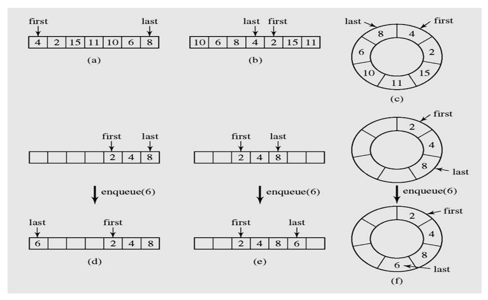

# **2. Stack and Queue Part 2: Queue**


# **Queues**

### **Objectives**

- Queues
- Priority Queues
- Queue interface in java.util


# **What is a queue?**

- A **queue** is a waiting line that grows by adding elements to its end and shrinks by taking elements from its front
- A queue is a structure in which both ends are used:
  - One for adding new elements
  - One for removing them
- A queue is an **FIFO** structure: **F**irst **I**n/**F**irst **O**ut


# **Operations on a queue**

- The following operations are needed to properly manage a queue:
  - *clear()* Clear the queue
  - *isEmpty()* Check to see if the queue is empty
  - *enqueue(el)* Put the element *el* at the end of the queue
  - *dequeue()* Take the first element from the queue
  - *front()* Return the first element in the queue without removing it sometimes the peek() is named instead of front().
- Exceptions
  - Attempting the execution of dequeue or front on an empty queue throws an EmptyQueueException


# **Queue example**

| Operation          |         | Output                          | Q           |
|--------------------|---------|---------------------------------|-------------|
| enqueue(<br>)<br>5 | –       | (<br>)<br>5                     |             |
| enqueue(<br>)<br>3 | –       | (<br>,<br>)<br>5<br>3           |             |
| dequeue()          | 5       | (<br>)<br>3                     |             |
| enqueue(<br>)<br>7 | –       | (<br>,<br>)<br>3<br>7           |             |
| dequeue()          | 3       | (<br>7<br>)                     |             |
| front()            |         | 7                               | (<br>7<br>) |
| dequeue()          | 7       | ()                              |             |
| dequeue()          | "error" | ()                              |             |
| isEmpty()          |         | true                            | ()          |
| enqueue(<br>)<br>9 | –       | (<br>)<br>9                     |             |
| enqueue(<br>)<br>7 | –       | (<br>,<br>)<br>9<br>7           |             |
| size()             | 2       | (<br>,<br>)<br>9<br>7           |             |
| enqueue(<br>3<br>) | –       | (<br>9<br>,<br>7<br>,<br>3<br>) |             |
| enqueue(<br>5<br>) | –       | (<br>9<br>,<br>7<br>,<br>3<br>, | 5<br>)      |
| dequeue()          | 9       | (<br>7<br>,<br>3<br>,<br>5<br>) |             |


# **Applications of Queues**

Queue is used when things don't have to be processed immediatly, but have to be processed in First In First Out order. This property of Queue makes it also useful in the following applications:

- Direct applications
  - Waiting lists
  - Access to shared resources (e.g., printer)
  - Multiprogramming
- Indirect applications
  - Auxiliary data structure for algorithms
  - Component of other data structures


#### **Application: Round Robin Schedulers**

We can implement a round robin scheduler using a queue, *Q*, by repeatedly performing the following steps:



**Round Robin Schedulers**

Round-robin (RR) is one of the simplest [scheduling algorithms](http://en.wikipedia.org/wiki/Scheduling_algorithm) for [processes](http://en.wikipedia.org/wiki/Computer_process) in an [operating system](http://en.wikipedia.org/wiki/Operating_system), which assigns [time slices](Time_slice) to each process in equal portions and in circular order, handling all processes without [priority](http://en.wikipedia.org/wiki/Priority). Round-robin scheduling is both simple and easy to implement, and [starvation](http://en.wikipedia.org/wiki/Resource_starvation)-free. Round-robin scheduling can also be applied to other scheduling problems, such as data packet scheduling in computer networks.

The name of the algorithm comes from the [round-robin](http://en.wikipedia.org/wiki/Round-robin) principle known from other fields, where each person takes an equal share of something in turn


# **Array-based Queue - 1**

- Use an array of size *N* in a circular fashion
- Two variables keep track of the first and last
  - *f* index of the front element
  - *l* index of the last element

normal configuration



wrapped-around configuration



**Array-based Queue**


# **Array-based Queue - 2**



**Array-based Queue in detail**


### **Array implementation of a queue - 1**

```
class ArrayQueue
 { protected Object [] a;
  protected int max;
  protected int first, last;
  public ArrayQueue()
    { this(10);
    }
  public ArrayQueue(int max1)
    { max = max1;
     a = new Object[max];
     first = last = -1;
    }
  public boolean isEmpty()
    { return(first==-1);}
  public boolean isFull()
    { return((first == 0 &&
     last == max-1) || first ==
last+1);
    }
```

```
private boolean grow()
     { int i,j;
      int max1 = max + max/2;
      Object [] a1 = new Object[max1];
      if(a1 == null) return(false);
      if(last>=first)
       for(i=first;i<=last;i++) a1[i-
first]=a[i];
       else
       { for(i=first;i<max;i++) a1[i-
first]=a[i];
         i = max-first;
         for(j=0;j<=last;j++) a1[i+j]=a[j];
       }
      a = a1;
      first = 0;
      last = max-1;
      max = max1;
      return(true);
     }
```


### **Array implementation of a queue - 2**

```
Data Structures and Algorithms in Java 11
void enqueue(Object x)
  { if(isFull() && !grow()) return;
   if(last == max-1 || last == -1)
     { a[0] = x; last=0;
       if(first==-1) first = 0;
     }
     else a[++last] = x;
  }
Object front() throws Exception
  { if(isEmpty()) throw new Exception();
   return(a[first]);
  }
public Object dequeue() throws Exception
  { if(isEmpty()) throw new Exception();
   Object x = a[first];
   if(first == last) // only one element
     {first = last = -1;}
     else if(first==max-1)
       first = 0;
       else
       first++;
   return(x);
  }
```


}

#### **Linked list implementation of a queue**

```
12 class Node
       { public Object info;
        public Node next;
        public Node(Object x, Node
      p)
         { info=x; next=p; }
        public Node(Object x)
         { this(x,null); }
       };
      class MyQueue
       { protected Node head,tail;
        public MyQueue()
         { head = tail = null; }
        public boolean isEmpty()
         { return(head==null);}
        Object front() throws Exception
         { if(isEmpty()) throw new
      Exception();
           return(head.info);
```

```
public Object dequeue() throws
Exception
  { if(isEmpty()) throw new Exception();
   Object x = head.info;
   head=head.next;
   if(head==null) tail=null;
      return(x);
  }
void enqueue(Object x)
  { if(isEmpty())
   head = tail = new Node(x);
   else
    { tail.next = new Node(x);
      tail = tail.next;
    }
  }
```


# **A Circular Queue**

In previous chapter , we implemented a *circularly linked list* class that supports all behaviors of a singly linked list, and an additional rotate( ) method that efficiently moves the first element to the end of the list. We can generalize the Queue interface to define a new CircularQueue interface with such a behavior, as shown below:

```
public interface CircularQueue extends Queue {
 /*Rotates the front element of the queue to the back of the queue.
  This does nothing if the queue is empty.*/
 void rotate( );
}
```

A Java interface, CircularQueue, that extends the Queue ADT with a new rotate( ) method. This interface can easily be implemented by adapting the CircularlyLinkedList class to produce a new LinkedCircularQueue class. This class has an advantage over the traditional LinkedQueue, because a call to Q.rotate( ) is implemented more efficiently than the combination of calls,

Q.enqueue(Q.dequeue( )), because no nodes are created, destroyed, or relinked by the implementation of a rotate operation on a circularly linked list.

A circular queue is an excellent abstraction for applications in which elements are cyclically arranged, such as for multiplayer, turn-based games, or round-robin scheduling of computing processes.


# **Queue Interface in Java - 1**

- Java interface corresponding to our Queue ADT
- Requires the definition of class EmptyQueueExce ption
- No corresponding built-in Java class

```
public interface Queue {
 public int size();
 public boolean isEmpty();
 public Object front()
     throws
EmptyQueueException;
 public void enqueue(Object
o);
 public Object dequeue()
     throws
```

}


### **Double-Ended Queues (Deque) - 1**

We next consider a queue-like data structure that supports insertion and deletion at both the front and the back of the queue. Such a structure is called a *doubleended queue*, or *deque*, which is usually pronounced "deck" to avoid confusion with the dequeue method of the regular queue ADT, which is pronounced like the abbreviation "D.Q."

The deque abstract data type is more general than both the stack and the queue ADTs. The extra generality can be useful in some applications. For example, we described a restaurant using a queue to maintain a waitlist. Occasionally, the first person might be removed from the queue only to find that a table was not available; typically, the restaurant will reinsert the person at the *first* position in the queue. It may also be that a customer at the end of the queue may grow impatient and leave the restaurant.


### **Double-Ended Queues (Deque) - 2**

<sup>16</sup> The deque abstract data type is richer than both the stack and the queue ADTs. To provide a symmetrical abstraction, the deque ADT is defined to support the following update methods:

addFirst(*e*): Insert a new element *e* at the front of the deque.

addLast(*e*): Insert a new element *e* at the back of the deque.

removeFirst( ): Remove and return the first element of the deque (or null if the deque is empty).

removeLast( ): Remove and return the last element of the deque (or null if the deque is empty).

Additionally, the deque ADT will include the following accessors:

first( ): Returns the first element of the deque, without removing it (or null if the deque is empty).

last( ): Returns the last element of the deque, without removing it (or null if the deque is empty).

size( ): Returns the number of elements in the deque.

isEmpty( ): Returns a boolean indicating whether the deque is empty.


# **Priority Queues**

- A **priority queue** can be assigned to enable a particular process, or event, to be executed out of sequence without affecting overall system operation
- FIFO rule is broken in these situations
- In priority queues, elements are dequeued according to their priority and their current queue position


#### **Array implementation of a priority queue - 1**

```
18 class PriorityQueue
        { protected float [] a; int top,
       max;
          public PriorityQueue()
           { this(50);
           }
          public PriorityQueue(int max1)
           { max = max1;
            a = new float[max];
            top = -1;
           }
          protected boolean grow()
           { int max1 = max + max/2;
            float [] a1 = new float[max1];
            if(a1 == null) return(false);
            for(int i =0; i<=top; i++)
                a1[i] = a[i];
             a = a1;
            return(true);
           }
```

```
public boolean isEmpty()
 { return(top==-1);}
public boolean isFull()
 { return(top==max-1);}
public void clear()
 { top=-1;}
public void enqueue(float x)
 { if(isFull() && !grow()) return;
  if(top==-1)
    { a[0] = x; top = 0;
      return;
    }
  int i = top;
  while(i>=0 && x<a[i])
    { a[i+1] = a[i];
       i--;
     }
  a[i+1] = x; top++;
 }
```


#### **Array implementation of a priority queue - 2**

```
public float front()
 { assert(!isEmpty());
  return(a[top]);
 }
public float dequeue()
{assert(!isEmpty());
  float x = a[top];
  top--;
  return(x);
 }
```


# **Summary**

- <sup>20</sup> A queue is a waiting line that grows by adding elements to its end and shrinks by taking elements from its front.
  - A queue is an FIFO structure: first in/first out.
  - In queuing theory, various scenarios are analyzed and models are built that use queues for processing requests or other information in a predetermined sequence (order).
  - A priority queue can be assigned to enable a particular process, or event, to be executed out of sequence without affecting overall system operation.
  - In priority queues, elements are dequeued according to their priority and their current queue position.


# **Reading at home**

**Text book: Data Structures and Algorithms in Java**

- 6.2 Queues 238
- 6.3 Double-Ended Queues (Deque) 248
- 9.1 The Priority Queue Abstract Data Type 360