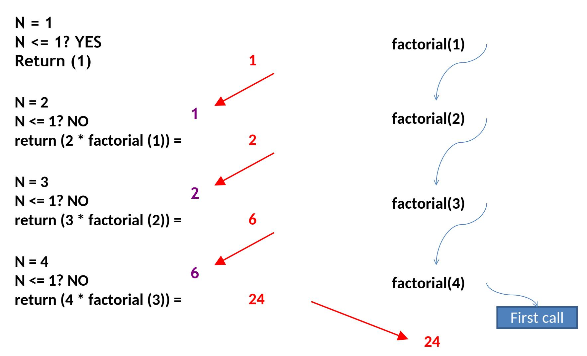
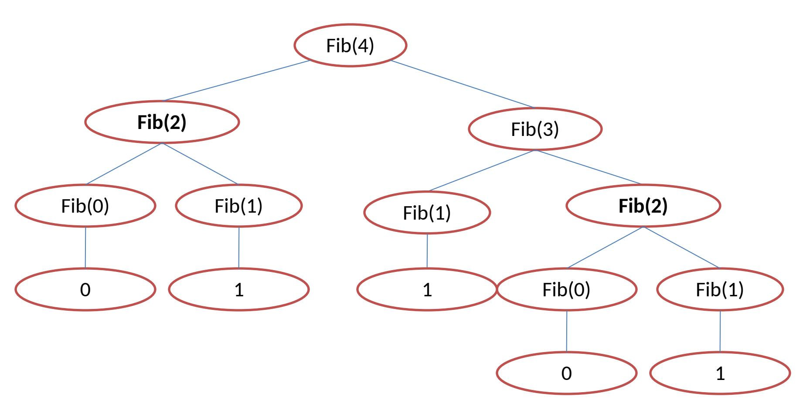
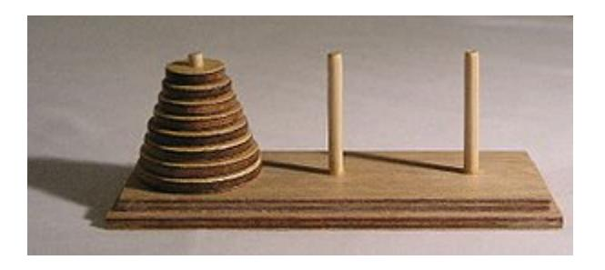
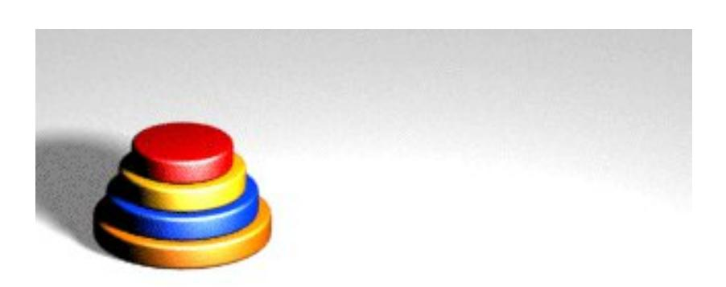
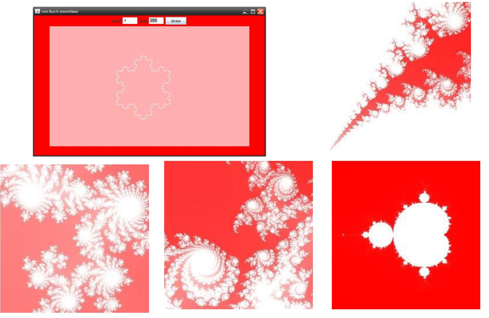
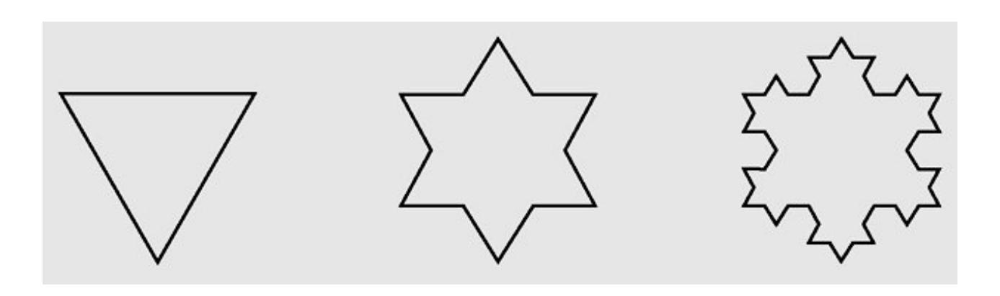

# **3. Recursion**


#### **Objectives**

- Recursive definition
- Recursive program/algorithm
- Recursion application
- Method calls and recursion implementation
- Anatomy of a recursive call
- Classify recursions by number of recursive calls
- Tail recursion
- Non-tail recursion
- Indirect recursion
- Nested recursion
- Excessive recursion


#### **Recursive definition**

- Wikipedia: "A recursive definition or inductive definition is one that defines something in terms of itself (that is, [recursively](http://en.wikipedia.org/wiki/Recursion)). For it to work, the definition in any given case must be [well-founded](http://en.wikipedia.org/wiki/Well-founded_relation), avoiding an [infinite regress](http://en.wikipedia.org/wiki/Infinite_regress)".
- A recursive definition consists of at least 2 parts:
  - 1) A base case (anchor or the ground case) that does not contain a reference to its own type.
  - 2) An inductive case that does contain a reference to its own type.

For example: Define the set of natural numbers


#### **Some other examples for recursive definition**

• The Factorial of a natural number:

$$\mathbf{n!} = \begin{cases} 1 & \text{if } n = 0 \text{ (anchor)} \\ n*(n-1)! & \text{if } n>0 \text{ (inductive step)} \end{cases}$$

• The Fibonacci sequence of natural numbers:

fibo(n) = 
$$\begin{cases} n & \text{if } n < 2 \\ fibo(n-1) + fibo(n-2) \text{ otherwise} \end{cases}$$


#### **Recursive program/algorithm - 1**

One way to describe repetition within a computer program is the use of loops, such as Java's while-loop and for-loop constructs. An entirely different way to achieve repetition is through a process known as *recursion*. Recursion is a technique by which a method makes one or more calls to itself during execution, or by which a data structure relies upon smaller instances of the very same type of structure in its representation. In computing, recursion provides an elegant and powerful alternative for performing repetitive tasks. Most modern programming languages support functional recursion using the identical mechanism that is used to support traditional forms of method calls. When one invocation of the method makes a recursive call, that invocation is suspended until the recursive call completes. Recursion is an important technique in the study of data structures and algorithms.


#### **Recursive program/algorithm - 2**

A recursive program/algorithm is one that calls itself again.

There are three basic rules for developing recursive algorithms.

- Know how to take one step.
- Break each problem down into one step plus a smaller problem.
- Know how and when to stop.

Example for recursive program:

```
public static void DecToBin(int n)
 { int q = n/2; // One step
   int r = n%2; // One step
   if (q > 0)
    {DecToBin(q); // smaller problem
    }
   System.out.print(r); // after all recursive calls have been
                                // made last remainder printed first
 }
```


#### **Recursion application**

- Recursive definitions are used in defining functions or sequences of elements
- Purpose of recursive definition:
  - Generating a new elements
  - Testing whether an element belongs to a set (\*)
- (\*) The problem is solved by reducing it to a simpler problem


#### **Method calls and recursion implementation - 1**

Each time a method is called, an activation record (AR) is allocated for it. This record usually contains the following information:

- Parameters and local variables used in the called method.
- A dynamic link, which is a pointer to the caller's activation record.
- Return address to resume control by the caller, the address of the caller's instruction immediately following the call.
- Return value for a method not declared as void. Because the size of the activation record may vary from one call to another, the returned value is placed right above the activation record of the caller.

Each new activation record is placed on the top of the run-time stack When a method terminates, its activation record is removed from the top of the run-time stack

Thus, the first AR placed onto the stack is the last one removed


#### **Method calls and recursion implementation - 2**

Creating an activation record whenever a method is called allows the system to handle recursion properly. Recursion is calling a method that happens to have the same name as the caller. Therefore, a recursive call is not literally a method calling it-self, but rather an instantiation of a method calling another instantiation of the same original. These invocation are represented internally by different activation records and are thus differentiated by the system.


#### **Anatomy of a recursive Call**



#### **Classification of recursive functions by number of recursive calls**

Considering the maximum number of recursive calls within the body of a single activation, there are 3 types of recursions.

- *Linear recursion*: Only 1 recursive call (to itself) in side the recursive function (e.g. binary search).
- *Binary recursion*: There exactly 2 recursive calls (to itself) in side the recursive function (e.g. Fibonacci number) .
- *Multiple recursion*: There are 3 or more recursive calls (to itself) in side the recursive function.


#### **Other classification of recursions**

### **Tail recursion**

• There is only one recursive call at the very end of a method implementation

```
class Main
 {static void tail(int n)
   {if(n >0)
      { System.out.print(n + " ");
        tail(n-1);
      }
   }
  public static void main(String [] args)
   {tail(10);
    System.out.println();
   }
 }
                                                      void nonTail (int i)
                                                       { if (i > 0)
                                                          {tail(i-1);
                                                           System.out.print (i + "");
                                                           tail(i-1);
                                                          }
                                                        }
```


#### **Non-tail recursion**

• The recursive call is not at the very end of a method implementation

```
public class Main
{public static void reverse() throws Exception
  {char ch = (char) System.in.read();
  if(ch != '\n')
   {reverse();
    System.out.print(ch);
   }
  }
 public static void main(String [] args) throws Exception
  {System.out.println("\nEnter a string to be reversed:");
  reverse();
  System.out.println("\n");
  }
}
```


# **Convert recursion implementation to iterative implementation using stack**

```
{public static void nonRecursiveReverse() throws Exception
 {MyStack t = new MyStack();
 char ch;
 while(true)
  {ch = (char) System.in.read();
   if(ch == '\n') break;
   t.push(ch);
  }
 while(!t.isEmpty())
   System.out.print(t.pop());
 }
```


### **Indirect recursion**

- If f() calls itself, it is direct recursive
- If f() calls g(), and g() calls f(). It is indirect recursion. The chain of intermediate calls can be of an arbitrary length, as in:

f() -> f1() -> f2() -> ... -> fn() -> f()

• *Example*: sin(x) calculation *Recursive call tree for sin(x)* sin(x) sin(x/3 ) tan(x/3) tan(x/3) sin(x/3) cos(x/3) sin(x/3 ) cos(x) sin(x/6) sin(x/6)

Data Structures and Algorithms in Java 15


### **Nested recursion**

- A function is not only defined in terms of itself but also is used as one of the parameters
- Consider the following examples:

$$h(n) = \begin{cases} 0 & \text{if } n=0 \\ n & \text{if } n>4 \\ h(2 + h(2n)) & \text{if } n<=4 \end{cases}$$

Another example of nested recursive recursion is

Ackermann's function:

$$A(0, y) = y + 1$$
  
 $A(x, 0) = A(x - 1, 1)$   
 $A(x, y) = A(x - 1, A(x, y - 1))$ 

This function is interesting because of its remarkably rapid growth.

$$A(3,1) = 2^4 - 3$$
  
 $A(4,1) = 2^{65536} - 3$ 


#### **Excessive recursion - 1**

• Consider the Fibonacci sequence of numbers

```
n if n<2
                 fibo(n-1) +fibo(n-2) otherwise
static long fibo(long n)
 {if (n<2)
       return n;
       else
       return(fibo(n-1)+fibo(n-2));
 }
                                          This
                                          implementation
                                          looks very natural
                                          but extremely
                                          inefficient!
   fibo(n) =
```


# *The tree of calls for fibo(4)* <sup>18</sup> **Excessive recursion - 2**




#### **More Examples – The Tower of Hanoi**

#### • *Rules*:

- ❑Only one disk may be moved at a time.
- ❑Each move consists of taking the upper disk from one of the rods and sliding it onto another rod, on top of the other disks that may already be present on that rod.
- ❑No disk may be placed on top of a smaller disk.



*Source: http://en.wikipedia.org/wiki/Hanoi\_tower*


#### **More Examples – The Tower of Hanoi** *Algorithm* <sup>20</sup>

```
void moveDisks(int n, char fromTower, char toTower, char auxTower)
  {if (n == 1) // Stopping condition
     Move disk 1 from the fromTower to the toTower;
     else
     {moveDisks(n - 1, fromTower, auxTower, toTower);
      move disk n from the fromTower to the toTower;
      moveDisks(n - 1, auxTower, toTower, fromTower);
     }
  }
```




#### **More Examples – Drawing fractals**



Data Structures and Algorithms in Java 21


#### **More Examples – Von Knoch snowflakes**



**Examples of von Koch snowflakes**

- 1. Divide an interval *side* into three even parts
- 2. Move one-third of *side* in the direction specified by *angle*


#### **Recursion vs. Iteration**

- Some recursive algorithms can also be easily implemented **with loops**
  - When possible, it is usually better to use iteration, since we don't have the overhead of the run-time stack (that we just saw on the previous slide)
- Other recursive algorithms are very difficult to do any other way


#### **Summary**

- Recursive definitions are programming concepts that define themselves
- Recursive definitions serve two purposes:
  - Generating new elements
  - Testing whether an element belongs to a set
- Recursive definitions are frequently used to define functions and sequences of numbers
- Tail recursion is characterized by the use of only one recursive call at the very end of a method implementation.


#### **Reading at home**

#### **Text book: Data Structures and Algorithms in Java**

- 5 Recursion 189
- 5.1 Illustrative Examples 191
- 5.1.1 The Factorial Function -191
- 5.1.3 Binary Search 196
- 5.1.4 File Systems 198
- 5.2 Analyzing Recursive Algorithms 202
- 5.3 Further Examples of Recursion 206
- 5.3.1 Linear Recursion 206
- 5.3.2 Binary Recursion . 211
- 5.3.3 Multiple Recursion 212
- 5.4 Designing Recursive Algorithms 214
- 5.6 Eliminating Tail Recursion -. 219