# **4. Trees Part 1**


# **Objectives**

- What is a Trees?
- Tree Terminology
- Tree examples
- Ordered Trees
- Tree Traversals
- Binary Trees
- Implementing Binary Trees
- Binary Search Tree
- Insertion
- Deletion


#### **What is a Tree? Trees, Binary Trees, and Binary Search Trees**

- In computer science, a tree is an abstract model of a hierarchical structure
- A tree consists of nodes with a parent-child relation
- Inspiration: family trees
- Applications:
  - Organization charts
  - File systems
  - Programming environments
- Every node except one (a root) has a unique parent.

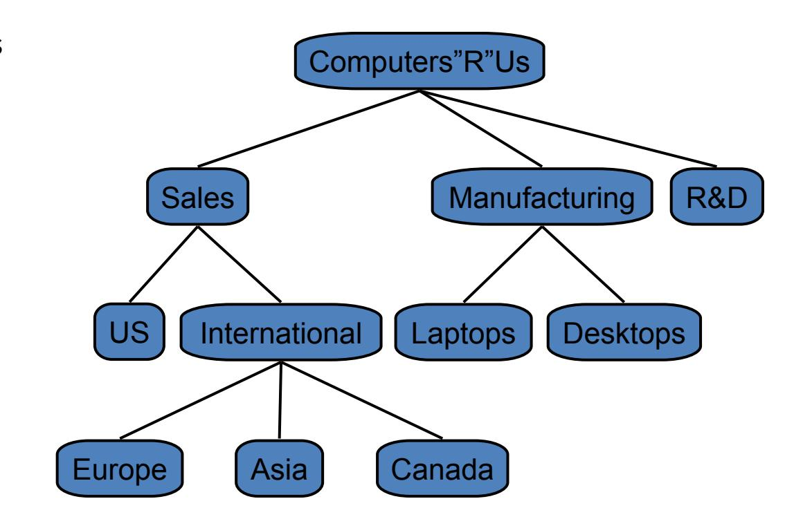

- **Empty structure is an empty tree.**
- **Non-empty tree consists of a root and its children, where these children are also trees.**

**Exact definition**


**Tree Terminology - 1** 

- Root: unique node without a parent
- Internal node: node with at least one child (A, B, C, F)
- External (leaf) node: node without children (E, I, J, K, G, H, D)
- Ancestors of a node: parent, grandparent, great-grandparent, ...
- **Descendants** of a node: child, grandchild, great-grandchild, etc.
- Level of a node: The level of the root is 1. If a father has level i then its children has level i+1.

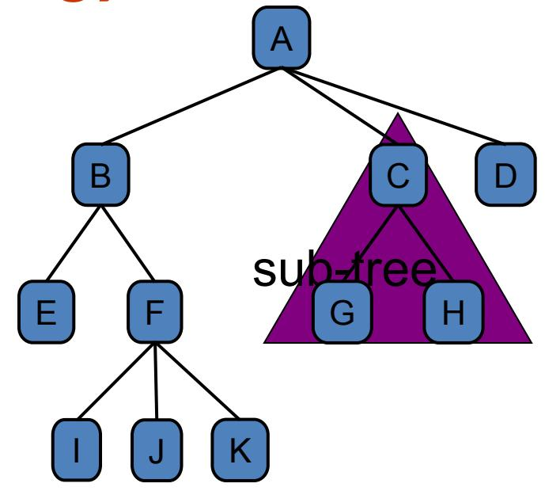

- **Sub-tree**: tree consisting of a node and its descendants
- (The level is known with other name: depth. In some documents a level of the root is defined as 0)
- Height of a tree: maximum level in a tree, thus a single node is a tree of height 1. The height of an empty tree is 0.
- **Height of a node** p is the height of the sub-tree with root p.
  - We can see that the height of a tree is the maximum number of nodes on a path from the root to a leaf node.
  - In text book and some other documents the height of a tree with single node is defined as 0


#### **Tree Terminology - 2**

- **Degree (order)** of a node: number of its non-empty childrens.
- Each node has to be reachable from the root through a unique sequence of arcs (edges), called a *path*
- The number of arcs in a path is called the *length of the path*

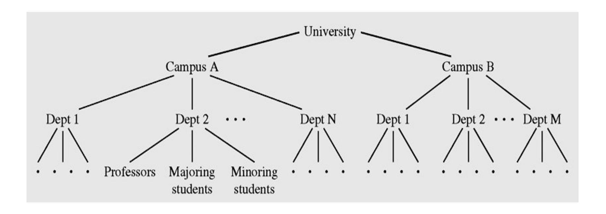

Tree example: Hierarchical structure of a university shown as a tree


#### Tree examples

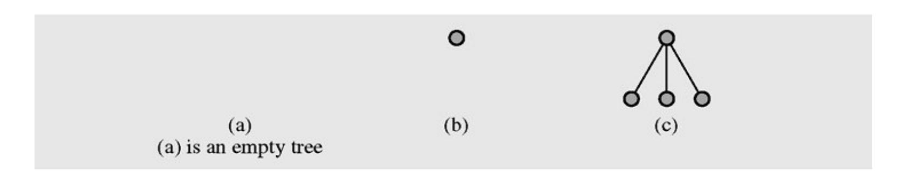

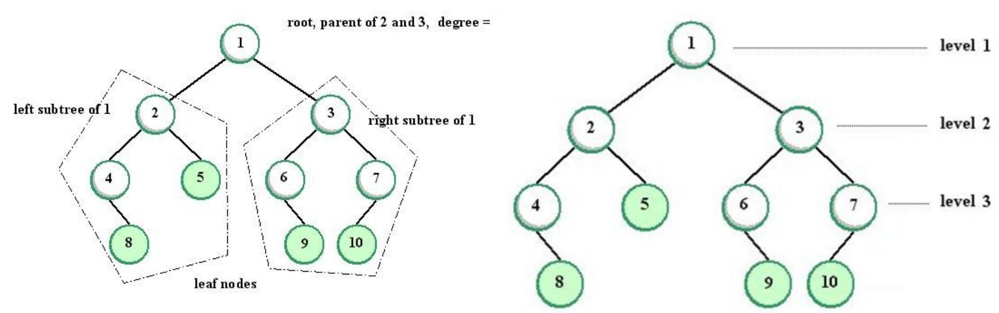

Image Source: JEDI


#### **Ordered Trees**

A tree is *ordered if there is a meaningful linear order among the children of each* node; that is, we purposefully identify the children of a node as being the first, second, third, and so on. Such an order is usually visualized by arranging siblings left to right, according to their order.

An ordered tree associated with a book.

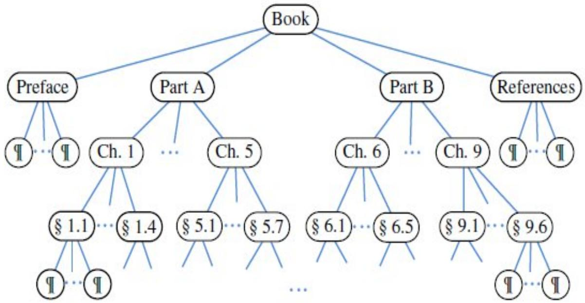

# Preorder and Postorder Traversals of General Trees Pre-order Traversal of a tree

- Tree traversal is the process of visiting each node in the tree exactly one time.
- In a pre-order traversal, a node is visited before its descendants
- Application: print a structured document

Algorithm preOrder(v)

visit(v)

for each child w

of v

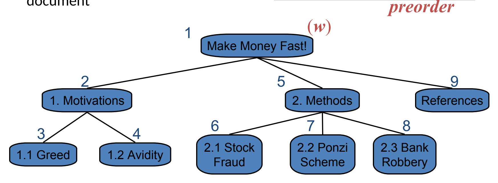


#### **Post-order Traversal of a tree**

- In a postorder traversal, a node is visited after its descendants
- Application: compute space used by files in a directory and its subdirectories

Algorithm postOrder(v)

for each child w

of v

postOrder

(w)

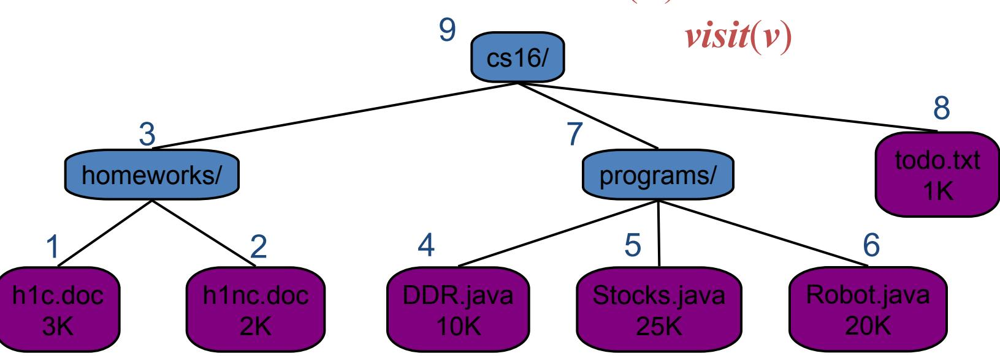


#### **Breadth-first Traversal of a tree**

- In a breadth-firth traversal, a node is visited first, then all its' children, then all its grandchildren,...
- Application: visit family tree by generations.

```
Algorithm breadthOrder(v)

visit(v)

visit all childs v1,v2,.. of

v

visit all childs of v1,

then all childs of v2,..
```

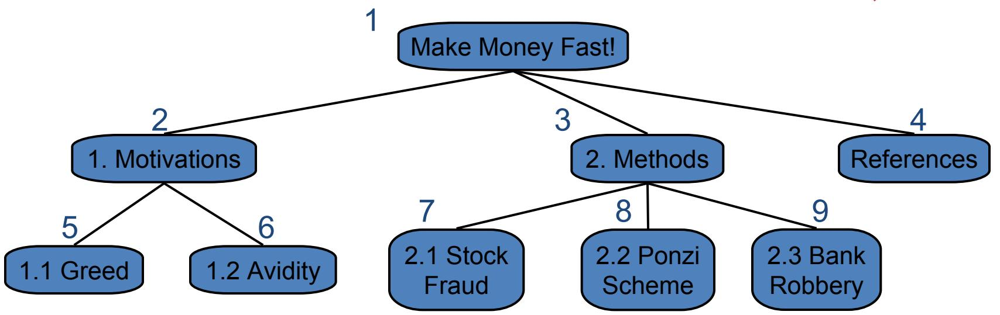


# **Binary Trees**

• A **binary tree** is a tree in which each node has at most two children. (Thus an empty tree is an binary tree). Each child may be empty and designated as either a left child or a right child

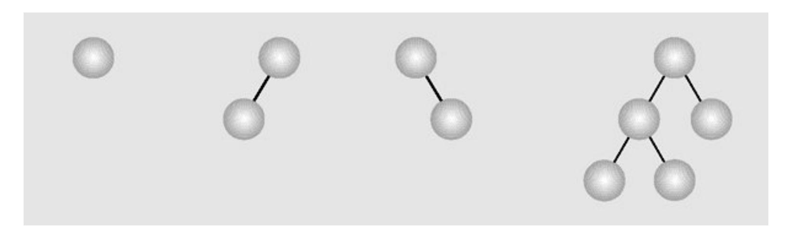

**Examples of binary trees**


# **Types of Binary Trees**

- In a **proper binary tree** (sometimes **full binary tree** or **2-tree**), every node other than the leaves has two children.
- In a **complete binary tree**, all non-terminal nodes have both their children, and all leaves are at the same level.

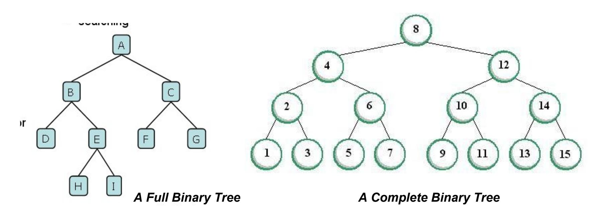


#### **Binary Tree example – Expression Tree**

Typical arithmetic expression tree is a proper binary tree, since each operator +, −, ∗, and / takes exactly two operands. Of course, if we were to allow unary operators, like negation (−), as in "−*x," then we could have an improper binary* tree.

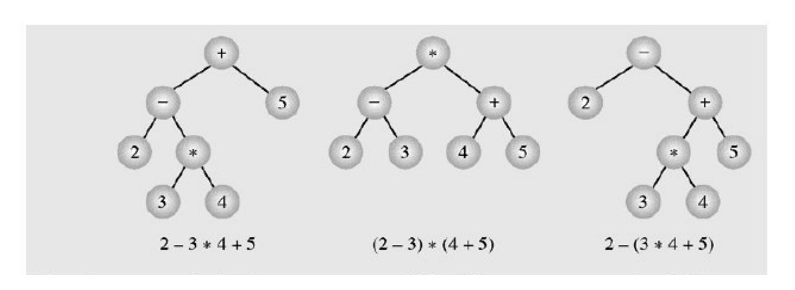


# **Binary Tree Traversals**

• **Breadth-first traversal** is visiting each node starting from the lowest (or highest) level and moving down (or up) level by level, visiting nodes on each level from left to right (or from right to left)

Breadth-first traversal:

A, B, C, D, E, F, G, H, I

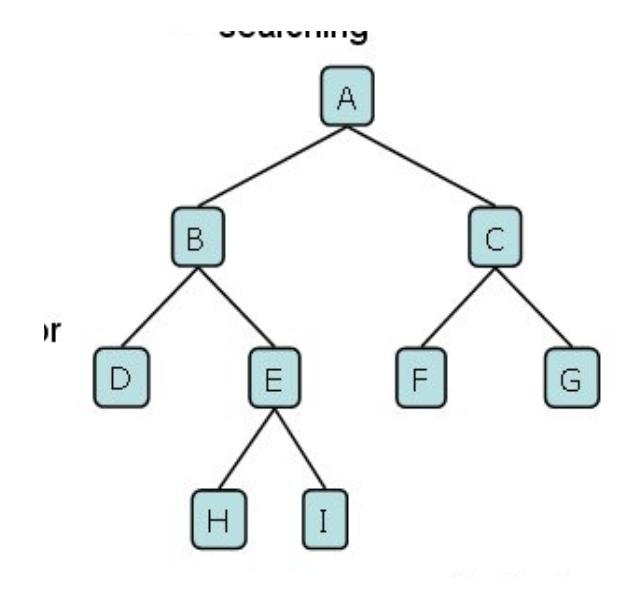


# **Depth-First Traversals**

N = node, L = left, R = right

```
Pre-order (NLR)
Algorithm preOrder(v)
       visit(v)
       preOrder (left child of
   v)
       preOrder (right child of
   v)
                                      In-order (LNR)
                                      Algorithm inOrder(v)
                                              inOrder (left child of
                                          v)
                                              visit(v)
                                              inOrder (right child of
                     v) Post-order (LRN)
                     Algorithm postOrder(v)
                             postOrder (left child of v)
                             postOrder (right child of
                         v)
                             visit(v)
```


# **Binary Tree Traversal example**

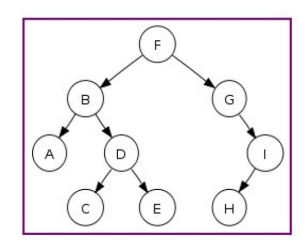

- Preorder traversal: F, B, A, D, C, E, G, I, H (root, left, right)
- Inorder traversal: A, B, C, D, E, F, G, H, I (left, root, right)
- Postorder traversal: A, C, E, D, B, H, I, G, F (left, right, root)
- Level-order traversal (breadth first): F, B, G, A, D, I, C, E, H


#### **Construct Binary Tree from given traversals**

From given traversals we can construct the tree. More exactly speaking, we can construct a tree from inorder&preorder or inorder&postorder traversals. Let us consider the below traversals:

Inorder sequence: D B E A F C Preorder sequence: A B D E C F

In a Preorder sequence, leftmost element is the root of the tree. So we know 'A' is root for given sequences. By searching 'A' in Inorder sequence, we can find out all elements on left side of 'A' are in left subtree and elements on right are in right subtree. So we know below structure now:

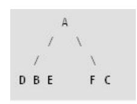

We recursively follow above steps and get the following tree:

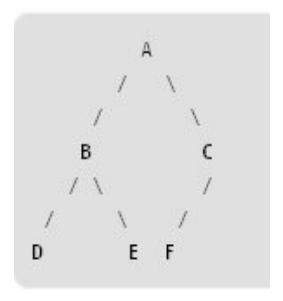


# **Implementing Binary Trees - 1**

- Binary trees can be implemented in at least two ways:
  - As arrays
  - As linked structures
- To implement a tree as an array, a node is declared as an object with an information field and two **"reference"** fields. These reference fields contain the indexes of the array cells in which the left and right children are stored, if there are any.
- However, it is hard to predict **how many nodes will be created** during a program execution. (Therefore, how many spaces should be reserved for the array?)


# **Implementing Binary Trees - 2**

• To implement a tree as a linked structure, a node is declared as an object with an information field and two "reference" fields.

```
class Node
{int info;
 Node left,right;
 Node(int x)
   {info=x;left=right=null;
   }
}
```

```
Key (data)
left child right child
```

```
class Node
{int info;
 Node left,right;
 Node(int x) { }
 Node(int x, Node p, Node q)
  {info=x;left=p; right=q;
  }
 Node(int x)
  {this(x,null,null);
  }
}
```

**Different types of implementations of Binary tree node**


# **Breadth-First Traversal code**

```
void breadth()
  { if(root==null) return;
    MyQueue q = new MyQueue();
    q.enqueue(root);
    Node p;
    while(!q.isEmpty())
      { p = (Node) q.dequeue();
       if(p.left !=null)
       q.enqueue(p.left);
       if(p.right !=null)
       q.enqueue(p.right);
       visit(p);
      }
  }
```

Top-down, left-to-right, breadth-first traversal implementation


# **Depth-First Traversal code**

```
void preOrder(Node p)
  { if(p==null) return;
   visit(p);
   preOrder(p.left);
   preOrder(p.right);
  }
void inOrder(Node p)
  { if(p==null) return;
   inOrder(p.left);
   visit(p);
   inOrder(p.right);
  }
```

```
void postOrder(Node p)
  { if(p==null) return;
    postOrder(p.left);
    postOrder(p.right);
    visit(p);
  }
```


# **Binary Search Trees**

- In computer science, a **binary search tree** (**BST**) is a node based binary tree data structure which has the following properties:
- The *left subtree* of a node contains only nodes with keys *less than the node's key*.
- The *right subtree* of a node contains only nodes with keys *greater than the node's key*.
- Both the left and right subtrees must also be binary search trees. From the above properties it naturally follows that:
- Each node (item in the tree) has a distinct key.

• An inorder traversal of a binary search trees visits the keys in increasing order

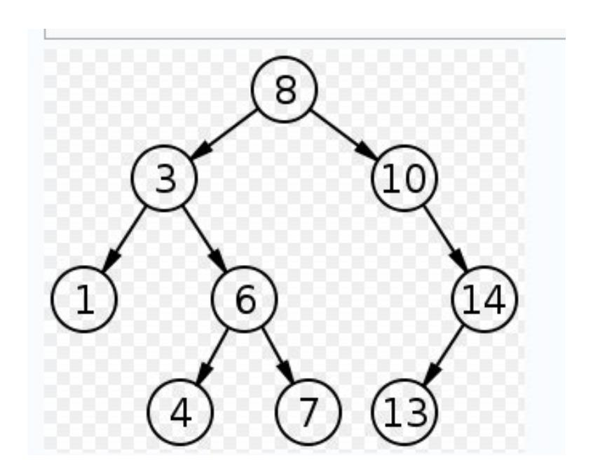


# **Implementing Binary Search Trees**

```
class Node
{int info;
 Node left,right;
 Node(int x)
   {info=x;left=right=null;
   }
}
```

```
class BSTree
  {Node root;
  BSTree() {root=null;}
  void insert(int x) {... }
  void visit(Node p) {...}
  void preOrder(Node p) {...}
  void inOrder(Node p) {...}
  void postOrder(Node p) {...}
  Node search(int x) {...}
  void deleteByMerging(int x) {...}
  void deleteByCopying(int x) {...}
  }
```


#### **Searching on Binary Search Trees**

```
Node search(Node p, int x)
  { if(p==null) return(null);
    if(p.info==x) return(p);
    if(x<p.info)
      return(search(p.left,x));
      else
       return(search(p.right,x));
   }
```


# **Insertion - 1**

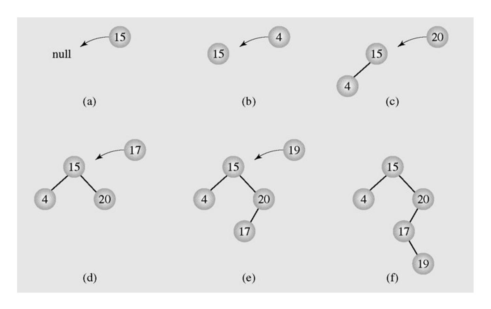

**Inserting nodes into binary search trees**


# **Insertion - 2**

```
26
  void insert(int x)
    {if(root==null)
      {root = new Node(x);
       return;
      }
    Node f,p;
    p=root;f=null;
    while(p!=null)
     {if(p.info==x)
       {System.out.println(" The key " + x
  + " already exists, no insertion");
       return;
       }
```

```
f=p;
if(x<p.info)
     p=p.left;
     else
     p=p.right;
   }
  if(x<f.info)
    f.left=new Node(x);
     else
     f.right=new Node(x);
  }
```


# **Deletion - 1**

- There are three cases of deleting a node from the binary search tree:
  - The node is a leaf; it has no children
  - The node has one child
  - The node has two children


# **Deletion - 2**

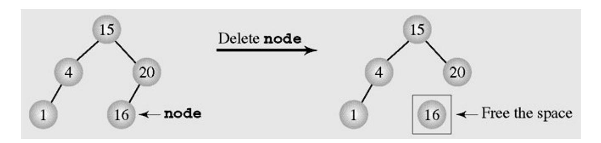

#### **Deleting a leaf**

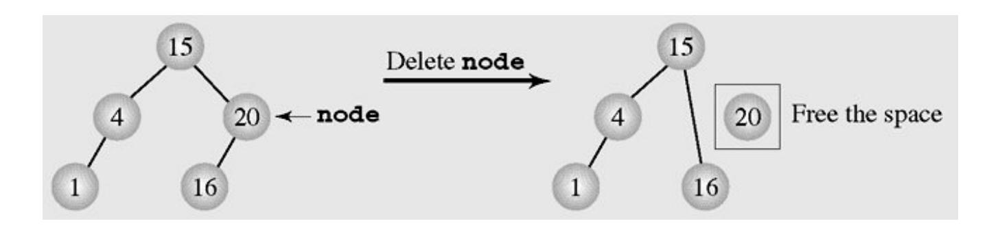

**Deleting a node with one child**


# **Deletion by Merging - 1**

• Making one tree out of the two subtrees of the node and then attaching it to the node's parent is called **deleting by merging**

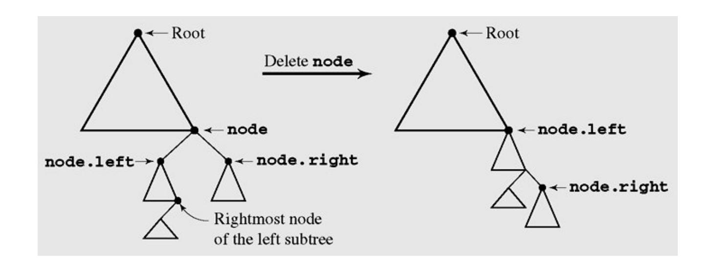

Deleting by merging


# **Deletion by Merging - 2**

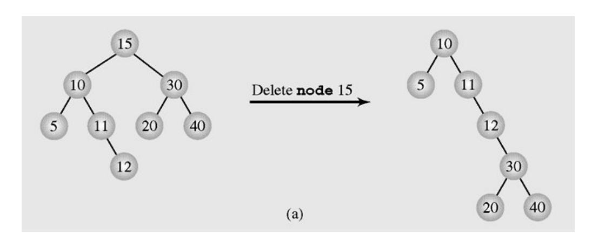

The height of a tree can be (a) extended or (b) reduced after deleting by merging

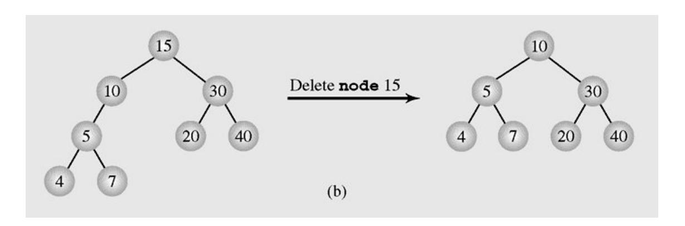


# **Deletion by Copying - 1**

- If the node has two children, the problem can be reduced to:
  - The node is a leaf
  - The node has only one non-empty child
- Solution: *replace the key being deleted with its immediate predecessor* (or successor)
- A key's predecessor is the key in the rightmost node in the left subtree


# **Deletion by Copying - 2**

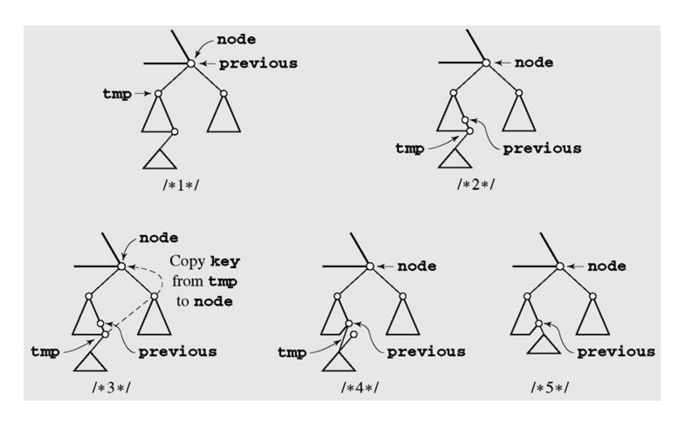

#### **Deleting by copying**


# **Summary**

- What is a Trees?
- Tree Terminology
- Tree examples
- Ordered Trees
- Tree Traversals
- Binary Trees
- Implementing Binary Trees
- Binary Search Tree
- Insertion
- Deletion


# **Reading at home**

**Text book: Data Structures and Algorithms in Java**

- 8 Trees 307
- 8.1 General Trees 308
- 8.1.1 Tree Definitions and Properties 309
- 8.1.2 The Tree Abstract Data Type 312
- 8.2 Binary Trees 317
- 8.2.1 The Binary Tree Abstract Data Type 319
- 8.2.2 Properties of Binary Trees 321
- 8.3 Implementing Trees 323
- 8.4 Tree Traversal Algorithms 334
- 11.1 Binary Search Trees 460
- 11.1.1 Searching Within a Binary Search Tree 461
- 11.1.2 Insertions and Deletions 463