# **4. Trees Part 2**


## **Objectives**

- Balanced Binary Tree Definitions
- Balancing a Tree Simple Balanced Algorithm
- Rotations on Binary Search Tree
- AVL Tree
- Insertion in an AVL Tree
- Deletion in an AVL Tree
- Heaps
- Heaps as Priority Queue
- Polish Notation and Expression Trees


## **Balanced Binary Tree Definitions**

- A binary tree is **height-balanced** if for every internal node *p* of *T*, the heights of the children of *p* differ by at most 1.
- A tree is considered **perfectly balanced** if it is heightbalanced and all leaves are to be found on one level or two levels.

What is a balanced tree in general? There are several ways to define "Balanced". The main goal is to keep the depths of all nodes to be O(log(n)).


#### **Why need to balance a Binary Search Tree?**

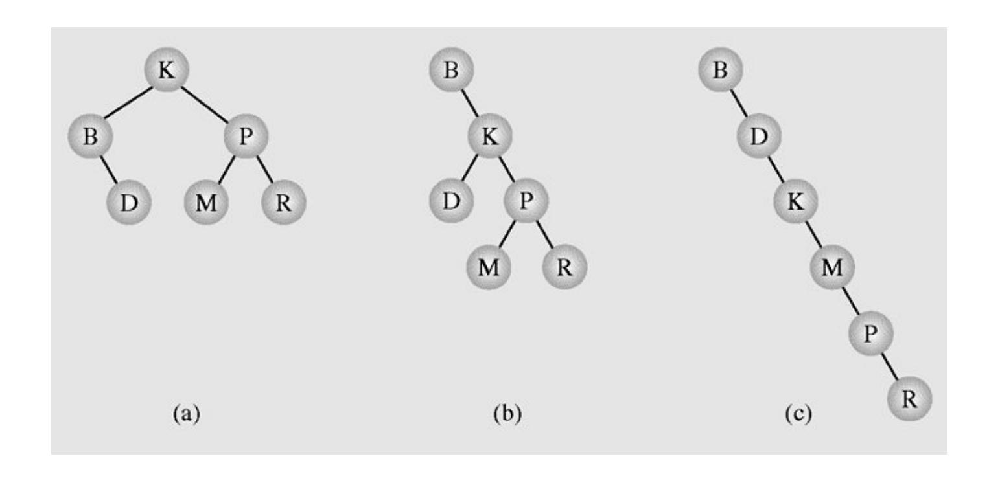

Different binary search trees with the same information


#### **Balancing a Tree -** *Simple Balance Algorithm - 1*

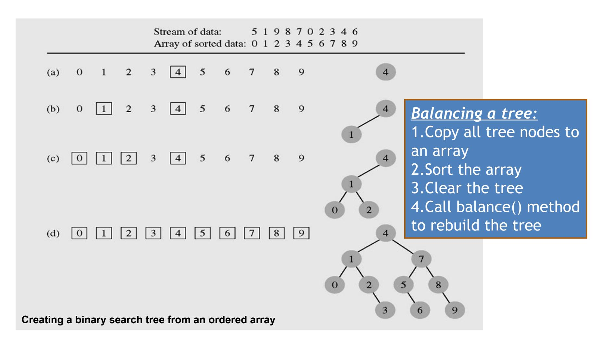


#### **Balancing a Tree -** *Simple Balance Algorithm - 2*

```
public void balance(T data[], int first, int last) {
    if (first <= last) {
       int middle = (first + last)/2;
       insert(data[middle]);
       balance(data,first,middle-1);
       balance(data,middle+1,last);
    }
  }
public void balance(T data[]) {
    balance(data,0,data.length-1);
  }
```


## **Rotations on Binary Search Tree**

#### *Right Rotation*

**rotateRight: rotate the node Par to right about its left child Ch**

**Ch become new root of the subtree** *Right subtree of* **Ch** *becomes left subtree of Par Par subtree becomes right subtree of Ch*

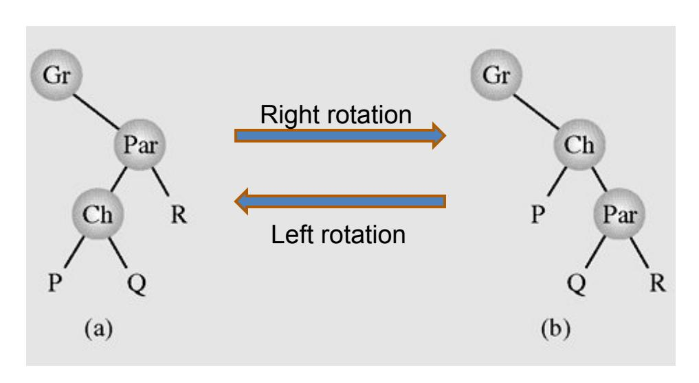

**Right rotation of Par about its' left child Ch**


#### **Rotations on Binary Search Tree demo - 1**

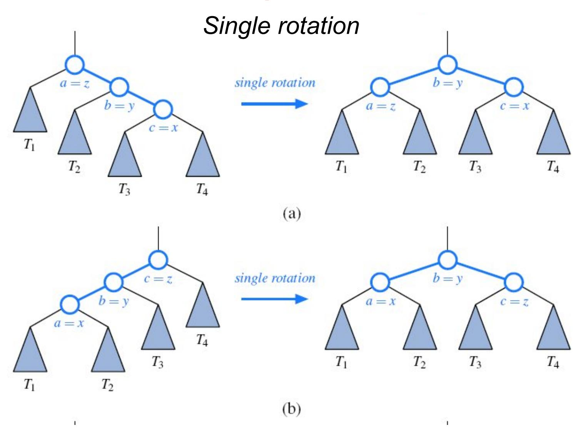


#### **Rotations on Binary Search Tree demo - 2**

#### *Double rotation*

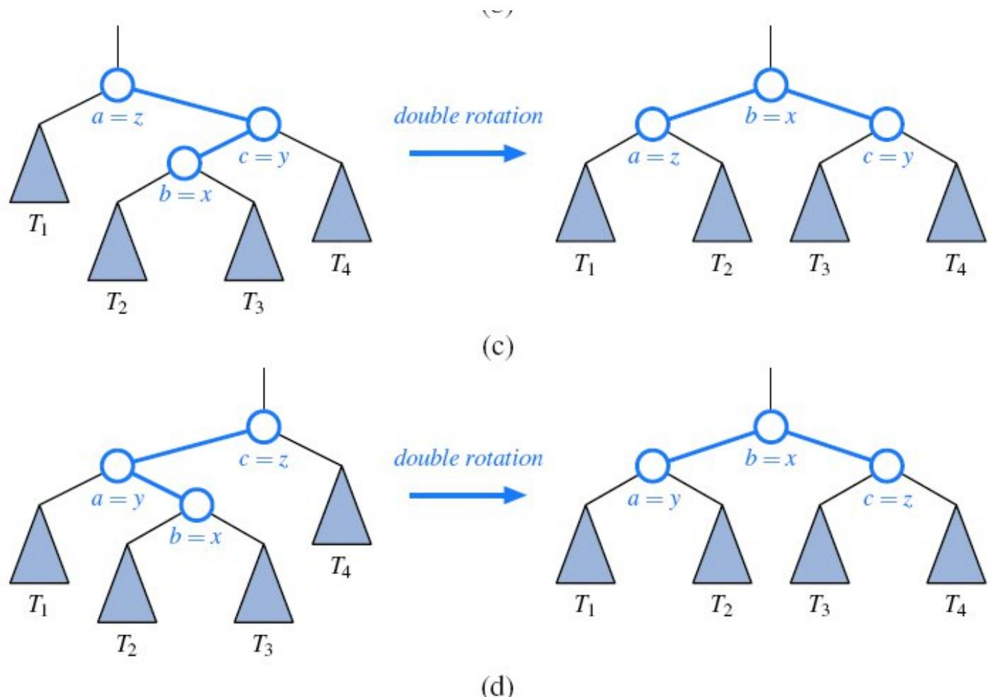


## **AVL Trees**

• An **AVL tree** *(by Adelson Velskii, Landis)* is a heightbalanced binary search tree.

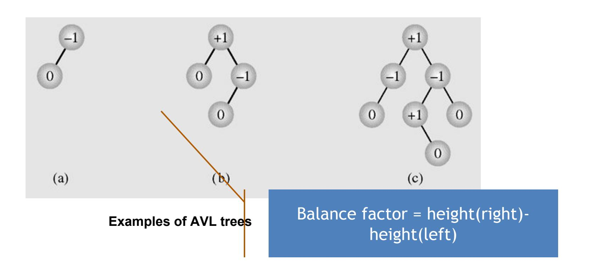


#### **Insertion algorithm in an AVL Tree**

- **Insert a node as in a binary search tree.**
- **Recalculate balance fator of nodes from the inserted node back to the root**.
  - If there is no unbalanced node (which means that no balance factors -2 or 2) in the tree then stop.
  - If we found the first node p whose balance factor is 2 or -2 then we should rotate p about his son. If p's and his son's balance factors have the same sign, then only single rotation should be done. If the signs of p and q are different then double rotation should be done: at first q is rotated, and then p.
    - Rotation rule: for left unbalane the right rotation should be used and vice versa.
  - It can be proved that for insertion, at most one rotation (single or double) should be done. That is because the height of the node to be rotated after rotation is exactly the same as its' height before inserting a new key, thus the heights of all **ancestors of p are unchanged.**


## **Insertion in an AVL Tree demo**

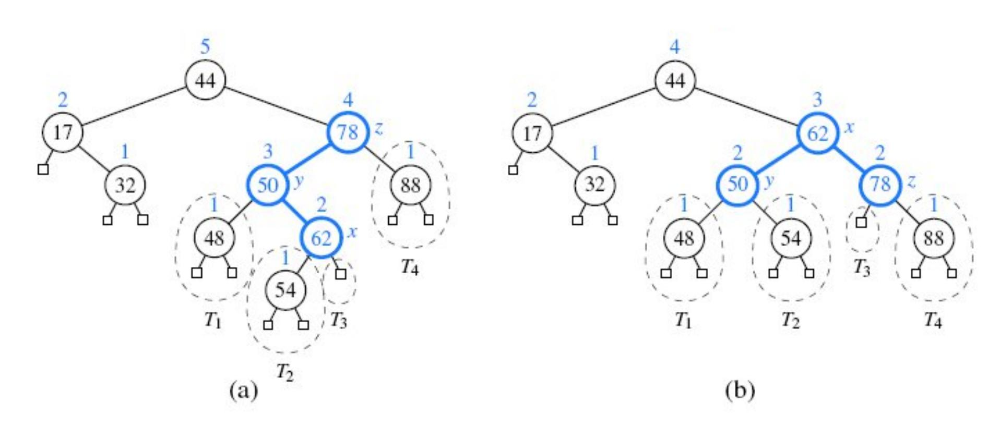

**Balancing a tree after insertion the key 54**


#### **Deletion algorithm in an AVL Tree**

- **Delete a node as in a binary search tree.**
- **Recalculate balance fator of nodes from the deleted node back to the root.**
  - If there is no unbalanced node (which means that no balance factors -2 or 2) in the tree then stop.
  - If we found the first node p whose balance factor is 2 or -2 then we should rotate p about his son. If p's and his son's balance factors have the same sign, then only single rotation should be done. If the signs of p and q are different then double rotation should be done: at first q is rotated, and then p.

Rotation rule: for left unbalane the right rotation should be used and vice versa.

– It can be proved that not the same as the case of insertion, in deletion the height of the rotated node p may be shorter by 1, thus it may causes the heights of p's ancestors shorter. Thus we should continue to balance until the height of rotated node is unchanged, and sometimes we do this to the root. Data Structures and Algorithms in Java 1313


## **Deletion in an AVL Tree demo**

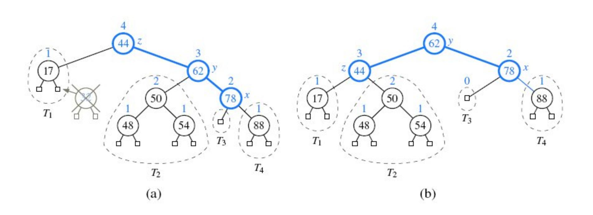

**Rebalancing an AVL tree after deleting the key 32**


- A particular kind of binary tree, called a **heap***,* has two properties:
  - The value of each node is greater than or equal to the values stored in each of its children
  - The tree is **nearly complete**, i.e. it is perfectly balanced, and the leaves in the last level are all in the leftmost positions

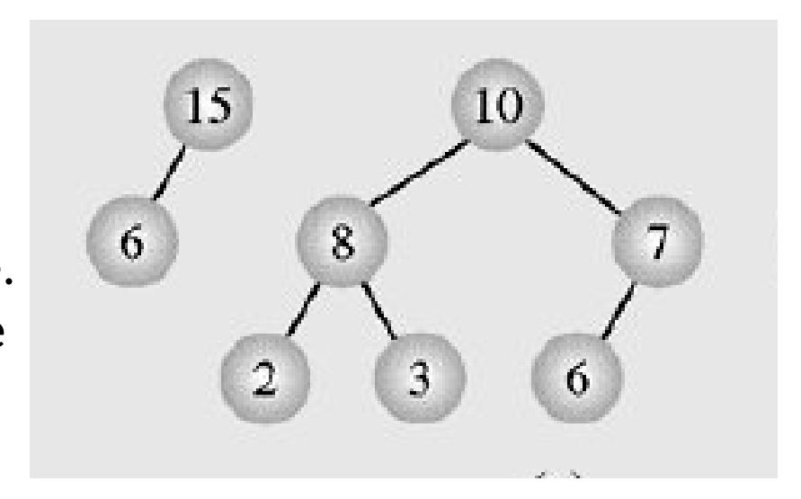

- These two properties define a **max heap**
- If "greater" in the first property is replaced with "less," then the definition specifies a **min heap**
- **Heap is used as Priority Queue and for heap-sorting**


We can represent heap by array in level order, going from left to right. The array corresponding to the heap above is [25, 13, 17, 5, 8, 3].

The root of the tree A[0] and given index *i* of a node, the indices of its parent, left child and right child can be computed:

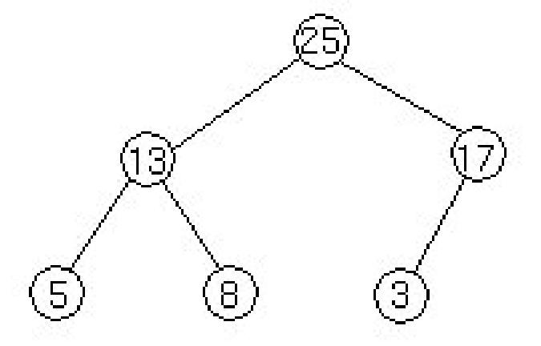

```
PARENT (i)
     return floor((i-1)/2)
LEFT (i)
     return 2i+1
RIGHT (i)
     return 2(i + 1)
```


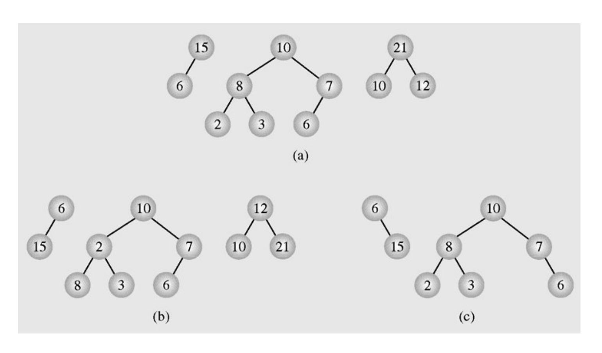

**Examples of (a) heaps and (b–c) non-heaps**


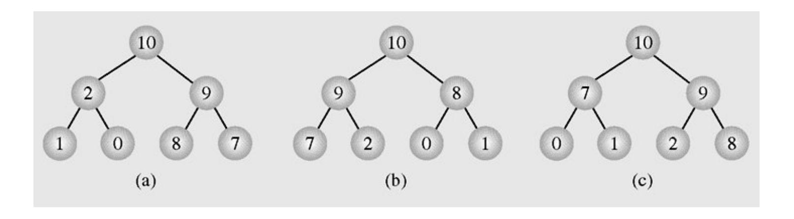

**Different heaps constructed with the same elements**


#### **Heaps as Priority Queues - 1**

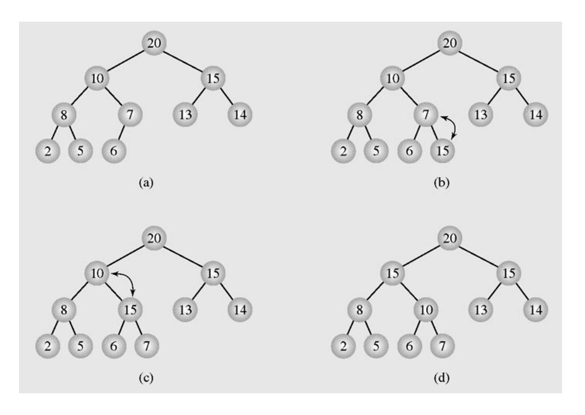

Enqueuing an element to a heap


#### **Heaps as Priority Queues - 2**

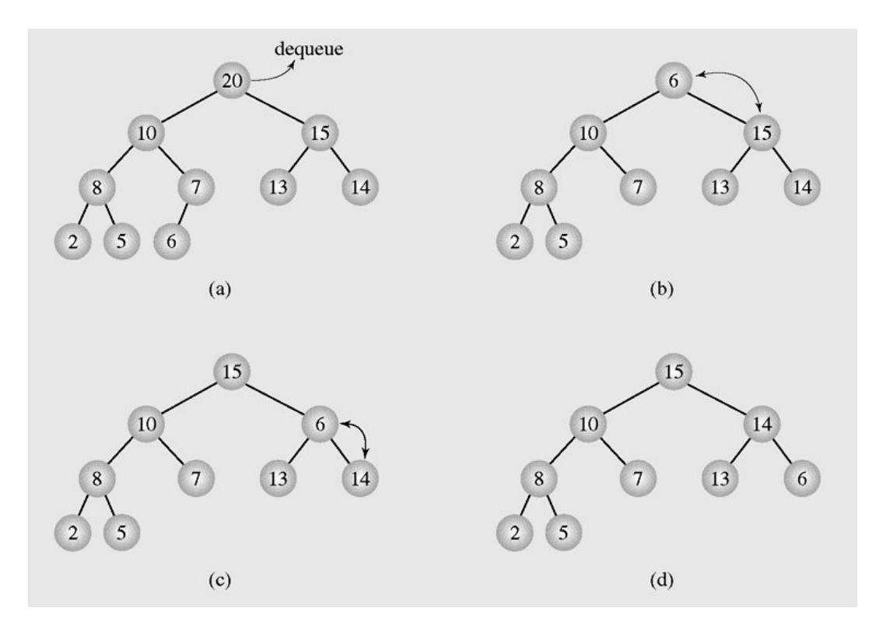

Dequeuing an element from a heap


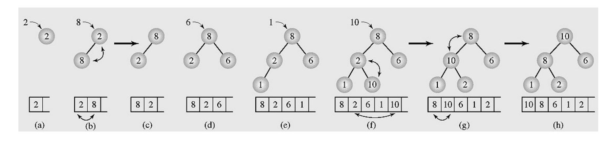

**Organizing an array as a heap with a top-down method**


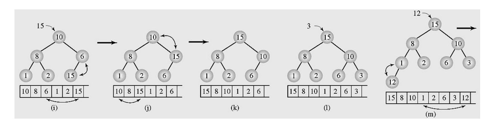

**Organizing an array as a heap with a top-down method (continued)**


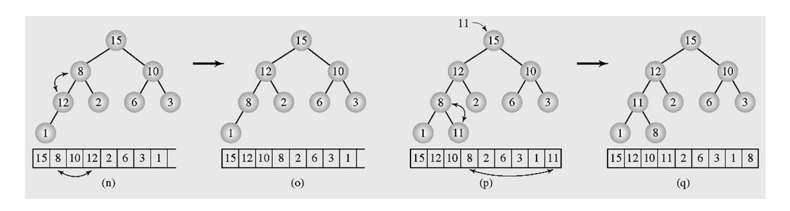

**Organizing an array as a heap with a top-down method (continued)**


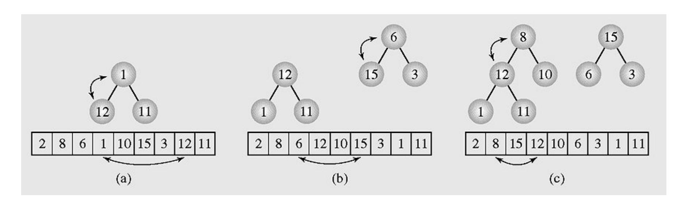

**Transforming the array [2 8 6 1 10 15 3 12 11] into a heap with a bottom-up method**


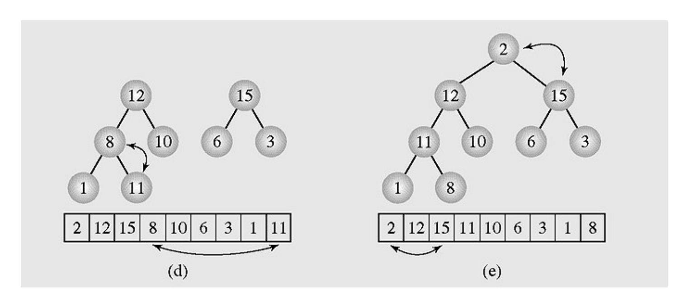

**Transforming the array [2 8 6 1 10 15 3 12 11] into a heap with a bottom-up method (continued)**


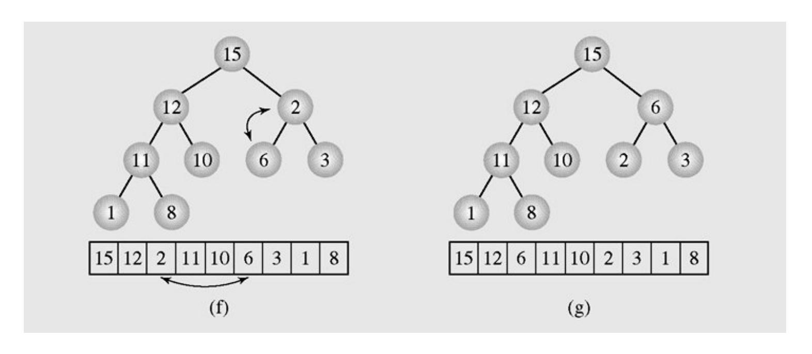

**Transforming the array [2 8 6 1 10 15 3 12 11] into a heap with a bottom-up method (continued)**


```
//Transform the array to HEAP
int i,s,f;int x;
for(i=1;i<n;i++)
  { x=a[i]; s=i; //s is a son, f=(s-1)/2 is father
   while(s>0 && x>a[(s-1)/2])
    { a[s]=a[(s-1)/2]; s=(s-1)/2; };
      a[s]=x;
    }
  }
```


```
// Transform heap to sorted array
for(i=n-1;i>0;i--)
 { x=a[i];a[i]=a[0];
   f=0; //f is father
   s=2*f+1; //s is a left son
  // if the right son is larger then it is selected
   if(s+1<i && a[s]<a[s+1]) s=s+1;
   while(s<i && x<a[s])
     { a[f]=a[s]; f=s; s=2*f+1;
     if(s+1<i && a[s]<a[s+1]) s=s+1;
     };
   a[f]=x;
  }; Data Structures and Algorithms in Java 2828
```


#### **Polish Notation and Expression Trees - 1**

- Polish notation is a special notation for propositional logic that eliminates all parentheses from formulas:
  - (5 − 6) \* 7 = \* − 5 6 7 (prefix notation)
- The compiler rejects everything that is not essential to retrieve the proper meaning of formulas.


#### **Polish Notation and Expression Trees - 2**

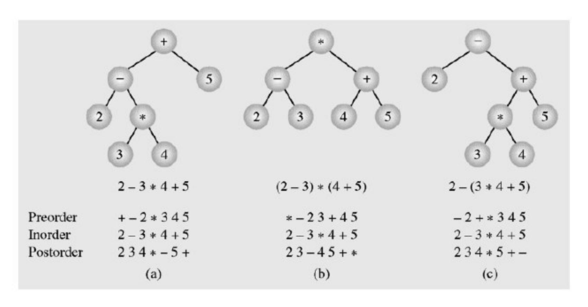

Examples of three expression trees and results of their traversals


## **Summary - 1**

- A tree is a data type that consists of nodes and arcs.
- The root is a node that has no parent; it can have only child nodes.
- Each node has to be reachable from the root through a unique sequence of arcs, called a path.
- An orderly tree is where all elements are stored according to some predetermined criterion of ordering.
- A binary tree is a tree whose nodes have two children (possibly empty), and each child is designated as either a left child or a right child.


## **Summary**

- Balanced Binary Tree
- Balancing a Tree Simple Balanced Algorithm
- Rotations on Binary Search Tree
- AVL Tree
- Insertion in an AVL Tree
- Deletion in an AVL Tree
- Heaps
- Heaps as Priority Queue
- Polish Notation and Expression Trees


## **Reading at home**

**Text book: Data Structures and Algorithms in Java**

- 11.2 Balanced Search Trees 472
- 11.3 AVL Trees 479
- 9.3 Heaps 370
- 9.3.1 The Heap Data Structure 370
- 9.3.2 Implementing a Priority Queue with a Heap 372